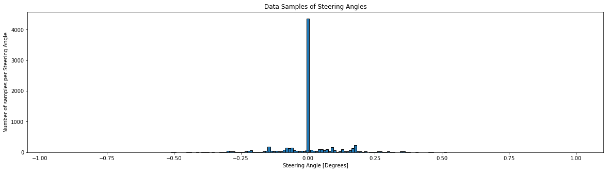
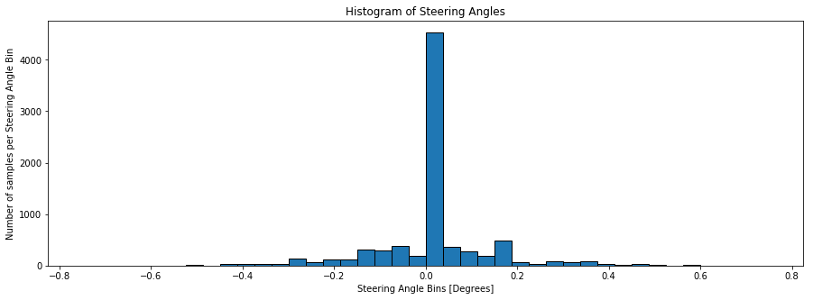
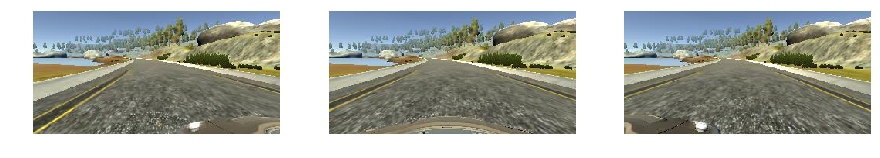
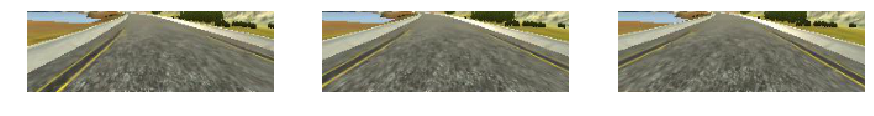
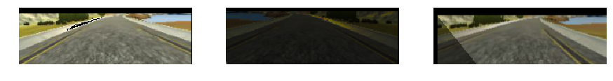
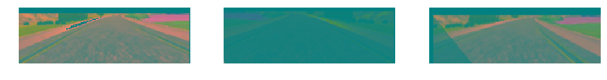
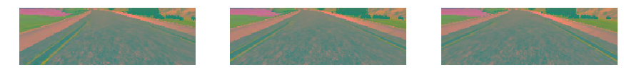
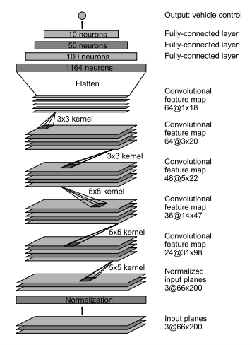
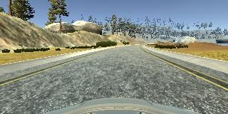

# Behavioral Cloning for Self-Driving Cars

The goal of this [notebook](Behavioral_Cloning.ipynb) is to explain the pipeline and training of a CNN capable of learning the appropiate way a car needs to drive. 


The CNN is trained using supervised learning: 
* The inputs to the CNN are images taken from the front-center, front-left and front-right images of a car. 
* The labels are the steering angles of the drive wheel.

The data for the CNN was obtained using [Udacity's simulator for MacOS X](https://d17h27t6h515a5.cloudfront.net/topher/2017/February/58ae4594_mac-sim.app/mac-sim.app.zip), which records input images and their corresponding steering angles of any chosen run one wants to record their data while driving the car. It is an open source simulator and free of use.

Sample data used in this notebook for training the CNN can be downloaded [here](https://d17h27t6h515a5.cloudfront.net/topher/2016/December/584f6edd_data/data.zip).

In order to run this notebook, one needs to download/get data from Udacity's simulator and save it in a folder name _data_ on the same directory of this notebook.

## 1. Data Analysis

First we load the sample data index csv file that only contains the name of the files, steering angle, speed, throttle, break, etc.


```python
import pandas as pd
import numpy as np
import tensorflow as tf
import matplotlib.pyplot as plt

%matplotlib inline

DATA_PATH = './data/'
DATA_CSV = DATA_PATH + 'driving_log.csv'

drive_data = pd.read_csv(DATA_CSV)

print('Columns in the {} file:'.format(DATA_CSV))
columns = drive_data.keys()
for c in columns:
    print('\t- {}'.format(c))

```

    Columns in the ./data/driving_log.csv file:
    	- center
    	- left
    	- right
    	- steering
    	- throttle
    	- brake
    	- speed


### 1.1. Columns Description

* The _center_, _left_ and _right_ columns are strings that have the path where the image of the corresponding camera for that row is stored.

* _Steering_ is the value of the driving wheel at the moment the picture was captured by the cameras and it is the label of the images.

* _Throttle_ is likely to be th change in time of the force pressing the gas pedal fo the car.

* _Brake_ and _speed_ are as their name indicate the stop and the speed of the car.

Below is an example of each column from a single row:


```python
print(drive_data.iloc[0])
```

    center      IMG/center_2016_12_01_13_30_48_287.jpg
    left          IMG/left_2016_12_01_13_30_48_287.jpg
    right        IMG/right_2016_12_01_13_30_48_287.jpg
    steering                                         0
    throttle                                         0
    brake                                            0
    speed                                      22.1483
    Name: 0, dtype: object


### 1.2. Quick Review of Data


```python
steering_unique = drive_data['steering'].unique()
n_unique_steering = len(steering_unique)
sorted_steering_unique = np.sort(steering_unique)

max_freq_steering = drive_data['steering'].value_counts().idxmax()

print('Number of Samples per Steering Angle: {}\n'.format(drive_data.shape[0]))
print('Unique Steering Angles: {}\n'.format(n_unique_steering))
print('Most Frequent Steering Angle: {}\n'.format(max_freq_steering))
print('Steering Angles:\n{}'.format(sorted_steering_unique))
```

    Number of Samples per Steering Angle: 8036
    
    Unique Steering Angles: 124
    
    Most Frequent Steering Angle: 0.0
    
    Steering Angles:
    [-0.9426954  -0.9332381  -0.9237437  -0.8098114  -0.771834   -0.7243622
     -0.6863848  -0.6294187  -0.6009356  -0.5344751  -0.5249807  -0.505992
     -0.4964977  -0.4775089  -0.4680146  -0.4585202  -0.4490258  -0.4395315
     -0.4300371  -0.4205428  -0.4110484  -0.401554   -0.3920597  -0.3825653
     -0.373071   -0.3540823  -0.3445879  -0.3350936  -0.3255992  -0.3161048
     -0.3066105  -0.2971161  -0.2876218  -0.2781274  -0.2686331  -0.2591387
     -0.2496443  -0.24015    -0.2306556  -0.2211613  -0.2116669  -0.2021725
     -0.1926782  -0.1831838  -0.1736895  -0.1641951  -0.1547008  -0.1452064
     -0.135712   -0.1262177  -0.1167233  -0.107229   -0.09773462 -0.08824026
     -0.0787459  -0.06925154 -0.05975719 -0.05026283 -0.04076847 -0.03127411
     -0.02177976 -0.0122854  -0.00279104  0.          0.00434871  0.01391724
      0.02348577  0.03305431  0.04262284  0.05219137  0.0617599   0.07132844
      0.08089697  0.0904655   0.100034    0.1096026   0.1191711   0.1287396
      0.1383082   0.1478767   0.1574452   0.1670138   0.1765823   0.1861508
      0.1957194   0.2052879   0.2148564   0.224425    0.2339935   0.243562
      0.2531306   0.2626991   0.2722676   0.2818362   0.2914047   0.3009732
      0.3105417   0.3201102   0.3296788   0.3392473   0.3488158   0.3583844
      0.3679529   0.3775214   0.38709     0.406227    0.4157956   0.4253641
      0.4349326   0.4445012   0.4540697   0.4636382   0.4732068   0.4827753
      0.4923438   0.5114809   0.5784606   0.5880292   0.6263033   0.6358718
      0.6454403   0.6550089   0.7315571   1.        ]


### 1.3. Graphing Data

We need to identify the distribution of the data to understand the gaps and fill them collecting more data, augmenting it or hopefully using it as is.

From the pratical analysis above one can tell the steering angles won't be that good of a label for classification  into classes. In order to confirm that we need to see it.


```python
steering_data = drive_data['steering']


plt.figure(figsize=(20,5))
xticks = np.array(steering_data.value_counts().index.values.tolist())
plt.bar(xticks,
        steering_data.value_counts().tolist(),
        width=0.01,
        align='center',
        edgecolor='black');

plt.title('Data Samples of Steering Angles');
plt.ylabel('Number of samples per Steering Angle');
plt.xlabel('Steering Angle [Degrees]');


```





The graph above confirms the steering angles spread in a wide range(infinite) and seem to have a normal distribution. It confirms that it is not possible to assign a fixed number of classes to the steering angles labels. Thus, the **best approach** will be to use **supervised learning - regression** to predict the _steering angle_ rather than considering logistic regression, which usually goes together with CNN networks.

A simple histogram can help identify the groups better, so that we understand the distribution of steering angles.


```python
plt.figure(figsize=(15,5))
plt.hist(steering_data, bins=40 ,range=(-0.75,0.75),edgecolor='black');
plt.title('Histogram of Steering Angles');
plt.ylabel('Number of samples per Steering Angle Bin');
plt.xlabel('Steering Angle Bins [Degrees]');
```





### 1.4. Some Statistics

Let's confirm that the **mode** for the **_steering angle_** is **_0.0_** with some simple statistics and at the same time get some statistics for the other numerical columns.


```python
print(drive_data.describe())
```

              steering     throttle        brake        speed
    count  8036.000000  8036.000000  8036.000000  8036.000000
    mean      0.004070     0.869660     0.001970    28.169839
    std       0.128840     0.301326     0.036565     6.149327
    min      -0.942695     0.000000     0.000000     0.502490
    25%       0.000000     0.985533     0.000000    30.183093
    50%       0.000000     0.985533     0.000000    30.186400
    75%       0.000000     0.985533     0.000000    30.186640
    max       1.000000     0.985533     1.000000    30.709360


After calculating the statistics of the data set, we confirmed that the _steering angle 0.0_ is the mode and that it is by a lot the value that repeats the most. This can cause our CNN to get bias and tend to predict an steering angle of 0.0 for most cases.

The previous analysis lead us to the conclusion that we need to either get more data where the steering angle is different than 0 or simply augment the data and that includes shifting the steering angle as part of it.

**NOTE:** _An important fact that we were missing to describe is that the histogram and data analysis above is done per row, meaning that every row is equivalent to three pictures. Thus, the actual values are three times what shown above if we intend to use left and right camera images._


```python
print('Number of Steering Angles per Images Set [Center, Left, Right]: {}\n'.format(drive_data.shape[0]))
print('Total Number of Images: {}'.format(drive_data.shape[0]*3))
```

    Number of Steering Angles per Images Set [Center, Left, Right]: 8036
    
    Total Number of Images: 24108


### 1.5. Visualizing Camera Images

The data is around 8036 per steering angle, but 3 images are associated to 1 steering angle. Thus, the total number of images is 24108. That is a very small data set, so augmentation is definitively an option for increasing the data set. 

In order to understand how to augment the data, it will be essential to look at what the images from the cameras look like.


```python
import random
import matplotlib.image as mpimg
import matplotlib.gridspec as gridspec

def show_images(images, n_range=3):
    """
    Displays Images
    Arguments:
    @image: Dataset of images
    @n_range: number of images to display
    """
    grid1 = gridspec.GridSpec(1,3)
    grid1.update(wspace=0.01, hspace=0.02) # set the spacing between axes.
    plt.figure(figsize=(15,30))
    for i in range(n_range):
        ax1 = plt.subplot(grid1[i])
        ax1.set_xticklabels([])
        ax1.set_yticklabels([])
        ax1.set_aspect('equal')
        img = images[i]
        #img = transform_image(image,20,10,5,brightness=1)

        plt.subplot(1,3,i+1)
        plt.imshow(img)
        plt.axis('off')

    plt.show()


DATA_ROW = random.randint(0, drive_data.shape[0])

center_img_path =  DATA_PATH + drive_data.iloc[DATA_ROW]['center'].strip() 
center_img = mpimg.imread(center_img_path)

left_img_path = DATA_PATH + drive_data.iloc[DATA_ROW]['left'].strip()
left_img = mpimg.imread(left_img_path)

right_img_path = DATA_PATH + drive_data.iloc[DATA_ROW]['right'].strip()
right_img = mpimg.imread(right_img_path)

img_steering_angle = drive_data.iloc[DATA_ROW]['steering']

print('Images Dimension:  {} x {} x {}\n\n'.format(center_img.shape[0],center_img.shape[1], center_img.shape[2]) )

print('Steering Angle: {} degrees\n'.format(img_steering_angle))
print('Left Image  : {}'.format(left_img_path))
print('Center Image: {}'.format(center_img_path))
print('Right Image : {}'.format(right_img_path))

print('\n==================== ORIGINAL IMAGES ====================')
imgs = [left_img, center_img, right_img]
show_images(imgs)
```

    Images Dimension:  160 x 320 x 3
    
    
    Steering Angle: 0.0 degrees
    
    Left Image  : ./data/IMG/left_2016_12_01_13_41_17_414.jpg
    Center Image: ./data/IMG/center_2016_12_01_13_41_17_414.jpg
    Right Image : ./data/IMG/right_2016_12_01_13_41_17_414.jpg
    
    ==================== ORIGINAL IMAGES ====================





## 2. Data Augmentation

The images above show that picture is a bit translated depending on the camera that took the picture. This is what we expected and thus we can actually augment data by doing translations and shifting the steering angle. Other augmentations can be to artificially generate different conditions:
* Flipping the image and inverting (multiplying with -1) the steering angle
* Adding random pieces of shadows to images
* Changing illumination/brightness  

Another important factor is that the images show the front of the car on the very bottom of the picture. Since the CNN model planned in here wants to generalize the data, having such information in the images is not useful for training. The CNN will most likely have better results if we make center, left and right images similar when training the model by chopping the bottom part of the image. If images are similar then our data multiplies by 3 and in the actual run the car will get 3 input images and any of them can help it know if it needs to change the steering angle. We simply increased 3 times our chances to stay in the center of the road by cropping the bottom of the images. Once the bottom is cut, we probably do not care of the top part as it has trees and mountains which do not directly impact the car lane. Thus, it might be a good idea to remove the top part as well and give less cluttered pictures to the CNN so that it can learn better. 

All in all, the steps to augment data can be set in the following order:
1. Crop the bottom and top of the image to focus on the lane
2. Apply translations, flips, shadows, brightness change, etc to augment the images
3. Modify the steering angle based on the changes above

Examples of how the data will look after augmentation are shown below


```python
import imgTools
import cv2

crop_imgs = []
aug_imgs = []
aug_steering = []
aug_yuv_imgs = []
for img in imgs:
    img = imgTools.crop(img)
    img = imgTools.resize(img)
    crop_imgs.append(img)

    aug_img, aug_steering_angle = imgTools.augment('', center_img_path, left_img_path, right_img_path,
                                      img_steering_angle, range_x=80, range_y=80)
    aug_imgs.append(aug_img)
    aug_steering.append(aug_steering_angle)
    
    #convert augmented img to yuv
    aug_yuv_imgs.append(cv2.cvtColor(aug_img,cv2.COLOR_RGB2YUV))

print('Original Steering Angle: {} degrees'.format(img_steering_angle))

print('\n==================== ORIGINAL IMAGES ====================')
show_images(imgs)

print('\n==================== CROPPED IMAGES ====================')
show_images(crop_imgs,3)

print('\n==================== AUGMENTED IMAGES ====================')
show_images(aug_imgs,3)

print('NOTE: Randomly chosen (center img doesn\'t mean it is center img)')
print('Original Steering Angle: {} degrees\n'.format(img_steering_angle))

print('New Steering Angle Left Image: {} degrees\n'.format(aug_steering[0]))
print('New Steering Angle Center Image: {} degrees\n'.format(aug_steering[1]))
print('New Steering Angle Right Image: {} degrees\n'.format(aug_steering[2]))

```

    Original Steering Angle: 0.0 degrees
    
    ==================== ORIGINAL IMAGES ====================


    
    ==================== CROPPED IMAGES ====================





    
    ==================== AUGMENTED IMAGES ====================





    NOTE: Randomly chosen (center img doesn't mean it is center img)
    Original Steering Angle: 0.0 degrees
    
    New Steering Angle Left Image: 0.19740756822301908 degrees
    
    New Steering Angle Center Image: -0.20334431516185256 degrees
    
    New Steering Angle Right Image: -0.190524346562779 degrees
    


## 3. Data Preprocessing

Once the images have been augmented we have something ready for training. However, we need to convert every image fed to the network from RGB to YUV color spaces to follow the model proposed by [NVIDIA's paper "End to End Learning for Self-Driving Cars"](./EndToEndDriving_NVIDIA.pdf). Since the model will be trained using YUV images, the images that will need to be fed into the CNN must also be YUV and of the same size as the augmented images. Thus, the preprocess step:

1. Crops the original images
2. Resizes the image to the augmented images size
3. Changes images from RGB to YUV


```python

print('\n=========== AUGMENTED IMAGES IN YUV COLOR SPACE============')
show_images(aug_yuv_imgs,3)


pre_process_imgs = []
for image in imgs:
    pre_process_imgs.append( imgTools.preprocess(image) )

print('\n=========== PRE-PROCESSED IMAGES ============')
show_images(pre_process_imgs,3)

```

    
    =========== AUGMENTED IMAGES IN YUV COLOR SPACE============





    
    =========== PRE-PROCESSED IMAGES ============





## 4. CNN Model

Notice that images above are not the same as augmented images adds random changes to the images and it also chooses randomly which images to augment. The pre-processed images come from the original images and do not add random changes to the images as these are meant to be the images the CNN will see in a normal run (not training, meaning not intended to generalize but to work).

Once we have the images as we wanted to input them to the CNN, it is time to define the CNN model or start testing some models. Since NVIDIA has published a model that generalizes well and has been tested in several scenarios, the CNN here will duplicate such model. The architecture gets images as inputs and outputs an steering angle value for every input.



As the model above shows, the images are resized to a size 3@66x200 (YUV color space). Then, they are normalized and convolution/sampling starts in order to find the necessary features for the network to learn how to predict the correct steering angle based on a fed image. **The only augmentation done to the network proposed by NVIDIA was to add a Dropout layer at the end of the convolutional layers.**


## 5. Training Setup

After several iterations trying to find the right learning rate, epochs and batch size, the hyper parameters chosen were:


| **Hyperparameter** | **Value** |
|--------------------|-----------|
| Learning rate      |  0.0001   |
| Samples per epoch  |  20000    |
| Batch size         |  40       |
| Dropout            |  0.5      |

## 6. Results

With such hyperparameters the network achieved

| **Loss**    | **Value** |
|-------------|-----------|
| Training    |  0.0176   |
| Validation  |  0.0083   |

The results of such training can be seen in the **video below**, where the car is driving autonomously and the camera onboard takes images of the road that are fed into the CNN to get an steering angle.

[](https://youtu.be/9RuirC5m9fA)

**Click the image above to watch the autonomous drive**

