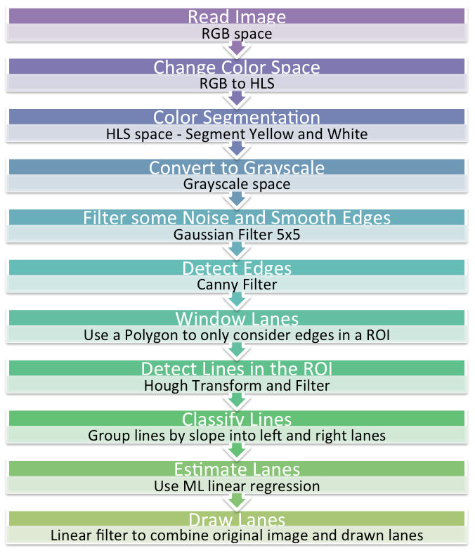

# **Finding Lane Lines and Lanes on the Road** 
This repository contains [code](./P1.ipynb) that aims to detect the lane a car is driving in. It uses OpenCV 3 (term `cv2` to refer to it here) and Python 3.

[//]: # (Image References)
[imageStartEnd]: ./Description_Images/StartEnd.png "StartEnd"
[imageOriginal]: ./Description_Images/OriginalImages.png "Original"
[imageHLS]: ./Description_Images/HLS.png "HLS"
[imageColorSeg]: ./Description_Images/ColorSegmentation.png "ColorSeg"
[imageGrayscale]: ./Description_Images/Grayscale.png "Grayscale"
[imageGauss]: ./Description_Images/GaussianFilter.png "Gaussian"
[imageCanny]: ./Description_Images/Canny.png "Canny"
[imageROI]: ./Description_Images/ROI.png "ROI"
[imageHough]: ./Description_Images/Hough.png "Hough"
[imageHoughOriginal]: ./Description_Images/HoughOriginal.png "HoughOriginal"
[imageGroupSlopes]: ./Description_Images/GroupSlopes.png "GroupSlopes"
[imageTwoSlopes]: ./Description_Images/TwoSlopes.png "TwoSlopes"
[imageLanes]: ./Description_Images/FilledLaneAndLines.png "Lanes"
[imageFillLane]: ./Description_Images/FillLane.png "FillLane"

![alt text][imageStartEnd]

## Getting Started
The following Jupyter Notebook needs a `python 3` kernel and it runs in a `conda` environment described in file  `environment.yml`. The Jupyter Notebook was tested in a Mac OS El Capitan.

To create the environment, use your terminal to navigate to the folder that contains  the `environment.yml` file and type the following command:

`$conda env create --file environment.yml`

## Description

### Image Processing Pipeline Overview
The whole process of detecting the lanes is based on computer vision algorithms.
The pipeline of such process is as follows:

#### 1. Read Image
It reads an image using the module `matplotlib.image` and if you want to read a video it uses the module `VideoFileClip` from `moviepy.editor`.

![alt text][imageOriginal]

#### 2. Change Color Space 
It changes the picture's current color space to _HLS_. This is done to help the color segmentation to reduce the sensitivity of color change due to light conditions.

![alt text][imageHLS]

#### 3. Color Segmentation
Since lanes are _white_ and _yellow_, the segmentation needs to consider both colors. One mask for each color in _HLS_ space is created and then both mask are `bitwise_OR` to result in one mask that filters both colors. Such mask is applied to the original image using a `bitwise_AND` to have a filtered image.
**_NOTE:_** The mask can be applied to the original image as the pixels' location in _HLS_ and _RGB_/_BGR_ never changed location only values.

![alt text][imageColorSeg]

#### 4. Grayscale Conversion
Here the color-segmented image is coverted to grayscale for further process

![alt text][imageGrayscale]

#### 5. Edge Smoothing and Noise Reduction
The image still has very sharp edges that can be considered noisy, so smoothing them is the right thing to do before trying to detect edges.

![alt text][imageGauss]

#### 6. Edge Detection
Apply the Canny edge detection algorithm to detect the all edges in the image. 

![alt text][imageCanny]

#### 7. Window Edges of Interest
After detecting edges there are still some that the lane detection does not need. Thus, a region of interest (ROI) is used to crete a window around the area of the current lane of the car.

![alt text][imageROI]

#### 8. Lane's Lines Detection
Once the ROI has filtered undesired edges, the [Hough Transform](https://alyssaq.github.io/2014/understanding-hough-transform/) is applied to find potential points of lines that constitute the lane lines. You can read more about Hough Transform implementation in OpenCV3 [here](http://docs.opencv.org/3.0-beta/doc/py_tutorials/py_imgproc/py_houghlines/py_houghlines.html).

![alt text][imageHough]

Then, these lines can be mapped to the original picture just for visual confirmation as below. In the pipeline one takes only the points that make such lines.

![alt text][imageHoughOriginal]

#### 9. Lines Classification
The set of points returned from the Hough algorithm are used to group the points by slope's sign. The right lane's line will have points with negative slope (_cyan_) and the left lane's line with positive slope (_yellow_). It was key to leave out points with slope values between [-0.2, 0.2], as they can be edges that couldn't be filtered and are not part of the lane's line.

![alt text][imageGroupSlopes]

#### 10. Lane Estimation
The goal is to obtain the line equation for each lane's lines. Since we have two sets of points grouped by slope and two different lines, it can be seen as two datasets for two different equations. Said that it is possible to use [Machine learning simple linear regression](http://scikit-learn.org/stable/modules/generated/sklearn.linear_model.LinearRegression.html) algorithm to estimate the two line's equations. 
An important key point in this step is that the images have their origin (0,0) on the top left. This makes it harder for us to use x as the features since the car is not always in the same x while it moves. However, the perspective of the car to see the horizon still the same and that is y. Thus, using y as the features to predict x as car moves gives a better result. 
In here, the line calculation uses Machine Learning Linear Regression with y as the features and x as the labels. 
The image below shows that each line was calculated from a different group of points.

![alt text][imageTwoSlopes]

#### 11. Drawing Lanes
Finally, once the line equations are estimated, the equations can be given the maximum value of y in the image to predict the corresponding x and find the points for the lanes on the bottom of the image. Then, the intersection-point of both lines can be calculated and used to determine the y coordinate to use to predict x and find the end point of the lines to draw.
These, same point can be used to draw a polygon that fills the are of the lane with a color.

![alt text][imageLanes]

or if you prefer you can only fill in the lane with a color

![alt text][imageFillLane]

All images are overlapped using a [linear blending](http://docs.opencv.org/3.1.0/d5/dc4/tutorial_adding_images.html).

---

## Suggested Improvements
The code has still a lot of space for improvement and make it more robust. Some improvements that can be made are:
* Implement a robust solution in the current pipeline for night time scenarios
* Handle the cases when there are no points returned from Hough transform
* Implement a distortion step to handle curves better
* Create an algorithm to dynamically reduce the ROI for lanes detection, but keep detecting cars infront in the same lane. This is to avoid miscalculation of lanes
* The current ML linear regression is basically overfitting  as it is calculated for each image. However, a smarter way could be to collect all data and train a lane detector algorithm that can be generalized to as many as possible lanes in different locations.

## Potential Shortcomings

The shortcomings are quite related to improvements in this case, and some of these are:
* Pipeline very dependent in the Hough transform and detection of points in every image
* It does not handle situations when white or yellow cars change lanes infront of the car and contribute to data in the ROI that causes nosie to calculate the lanes.
* It has never been tested at night time
* It considers the camera is calibrated and fixed to one position in the car
* The car is only aware of its lane due to the ROI used

---

With all of these improvements and shortcomings mentioned, hope one of you get interested in contributing to this repo and create together a more robust and generalized pipeline for lane detection.
